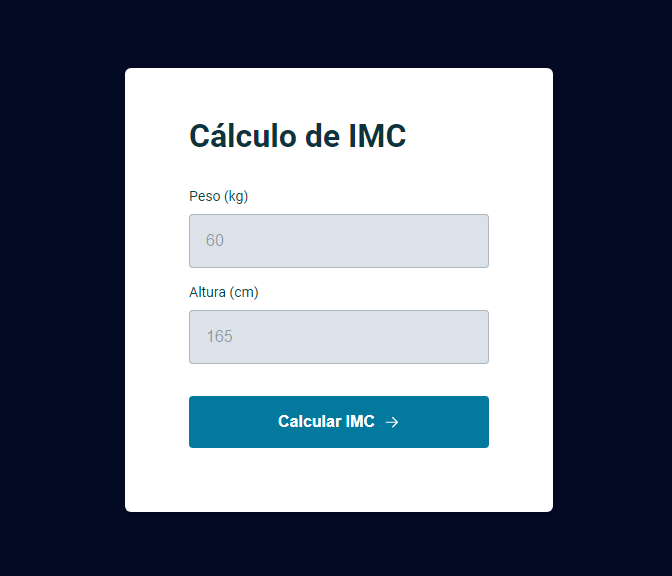

# Projeto IMC do curso Explorer da Rocketseat

    
    
    

Calculadora de Índice de Massa Corporal (IMC) é uma aplicação simples para calcular o IMC com base no peso e altura fornecidos pelo usuário.

## :building_construction: Funcionalidades

- Entrada de Dados: Permite ao usuário inserir seu peso e altura.
- Cálculo de IMC: Calcula automaticamente o IMC com base nos dados fornecidos.
- Feedback de Resultado: Exibe um modal com o resultado do IMC calculado.

## :exclamation: Pré-requisitos

Navegador web moderno

## :hammer: Intalação

1. Clone o repositório: git clone https://github.com/Raissa-Cardoso/XR-IMC.git
2. Abra o arquivo `index.html` em seu navegador web.

## :computer: Uso

1. Preencha os Campos: Insira seu peso em quilogramas e altura em centímetros nos campos apropriados.
2. Calcule o IMC: Clique no botão "Calcular IMC" para obter o resultado.
3. Verifique o Resultado: Um modal aparecerá mostrando o seu IMC.

⚠️ Nota: O IMC é uma medida simples que não leva em consideração outros fatores importantes para a saúde. Consulte um profissional de saúde para uma avaliação completa.

## :star: Tecnologias utilizadas

- **`HTML`**
- **`CSS`**
- **`Javascript`**